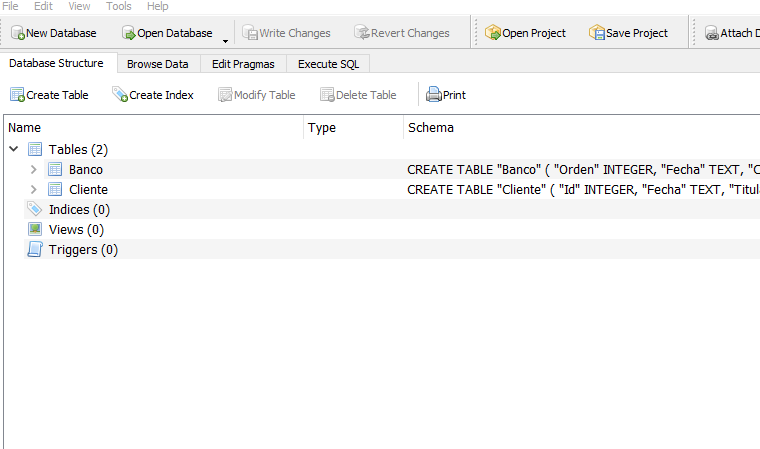
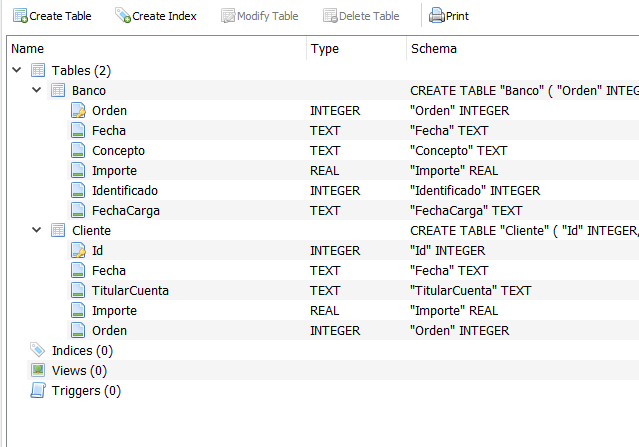

## Tablas Base de Datos

Relacion de Datos. 1:1   
El software busca datos de la planilla cliente en la planilla Banco y trae el numero de Orden de Banco a Cliente.   
Cunado lo encuentra, ingresa el dato Id de cliente en Banco -> Identificado.   
Es muy importante que el dato Banco -> Orden no traiga duplicados.   

En la planilla Clientes, no viene la columna Id, ya que la base de datos, lo genera y es un numero entero que se autoincrementa. Este tipo de campos se llama Primary Key. 

Los datos que envia el banco se suben a la tabla Banco. Los de cliente a  la tabla Cliente. Son archivos csv  
que se importan a la Base de Datos.   

El archivo de excel de Cliente debe traer campos (columnas) desde Fecha   

