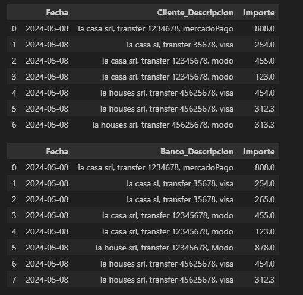
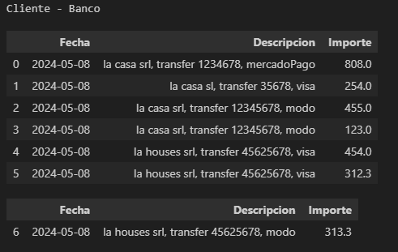
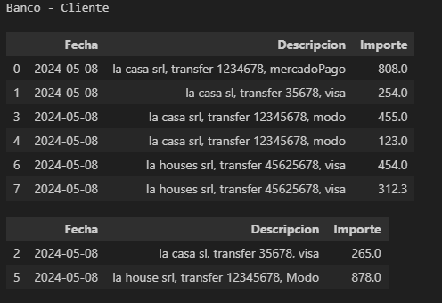
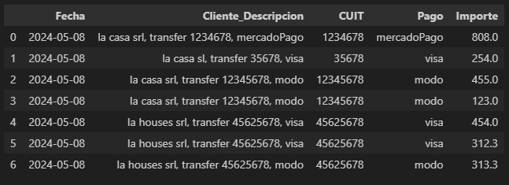

## Conciliacion Bancaria

### Cruce de Datos

Datos ejemplo de Cliente y Banco



#### Datos de Cliente -> Banco

- Datos de Cliente en Banco 
- Datos de Cliente No en Banco



#### Datos de Banco ->  Cliente

- Datos de Banco en Cliente
- Datos de Banco No en Cliente



#### Extraer, Separar datos de Columna Descripcion



#### Encontrar Duplicados

A veces enocntrar dupliacados en excel es dificil, pero escribiendo codigo, se resuelve 
en pocas lineas. 

Comparamos dos strings: t1 y t2, y pedimos que calcule una distancia entre los strings. Donde 1 indica que son iguales y 0 completamente distintos. 

De esta manera el error humano en una carga de datos duplicados es fácil de detectar. 

```python
import difflib
t1 = 'san amrtin bulones, mercadoPago, 1245678912'
t2 = 'san Martin bulones, mercadopago, 1245678912'

print('distancia entre t1 vs t2: ', difflib.SequenceMatcher(None, t1, t2).ratio())
```

> distancia entre t1 vs t2:  0.9534883720930233


